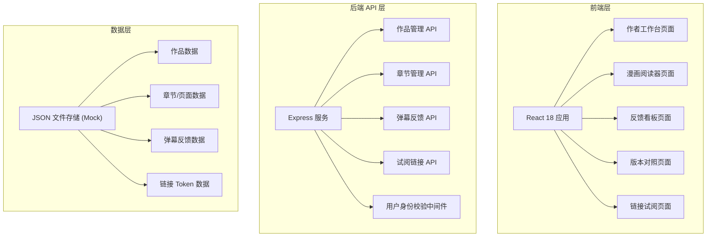

## 1. 架构设计



## 2. 技术描述

- **前端**：React@18 + TypeScript + tailwindcss@3 + Vite + zustand + react-router-dom
- **初始化工具**：vite-init
- **后端**：Express@4 + TypeScript
- **数据存储**：基于JSON文件作为Mock数据存储，文件上传存储于 `api/data` 目录
- **状态管理**：zustand 管理前端全局状态（作品、反馈、用户身份）
- **路由**：react-router-dom 负责页面路由
- **图标**：lucide-react
- **HTTP客户端**：fetch API (内置）

## 3. 核心页面路由定义

| 路由路径 | 页面 | 说明 |
|---------|------|------|
| / | 作者工作台 | 作品列表与管理中心 |
| /work/:workId | 作品详情 | 章节管理与链接生成 |
| /work/:workId/feedback | 反馈看板 | 反馈筛选查看与状态标记 |
| /work/:workId/compare/:pageIndex | 版本对照 | 新旧页面弹幕对比视图 |
| /read/:token | 漫画阅读页 | 试阅链接对应的读者阅读与反馈 |

## 4. API 定义

### 4.1 类型定义

```typescript
// 用户角色
type ReaderRole = 'editor' | 'assistant' | 'fan';
type FeedbackType = 'confusing' | 'slow' | 'funny' | 'cute' | 'detail';
type FeedbackStatus = 'pending' | 'resolved' | 'ignored';

// 作品
interface Work {
  id: string;
  title: string;
  description: string;
  coverUrl: string;
  createdAt: string;
  chapters: Chapter[];
}

// 章节
interface Chapter {
  id: string;
  workId: string;
  title: string;
  pages: Page[];
  createdAt: string;
}

// 页面（支持多版本）
interface Page {
  id: string;
  chapterId: string;
  imageUrl: string;
  version: number;
  pageIndex: number;
  width: number;
  height: number;
  createdAt: string;
}

// 弹幕反馈
interface Feedback {
  id: string;
  pageId: string;
  workId: string;
  type: FeedbackType;
  role: ReaderRole;
  content: string;
  // 相对坐标（0-1 的比例值）
  region: {
    x: number;
    y: number;
    width: number;
    height: number;
  };
  status: FeedbackStatus;
  pageVersion: number;
  createdAt: string;
  reviewerName: string;
}

// 试阅链接
interface ShareLink {
  id: string;
  workId: string;
  chapterId: string;
  token: string;
  role: ReaderRole;
  expiresAt: string;
  createdAt: string;
}
```

### 4.2 API 端点

| 方法 | 路径 | 说明 |
|------|------|------|
| GET | /api/works | 获取作品列表 |
| POST | /api/works | 创建新作品 |
| GET | /api/works/:id | 获取作品详情 |
| POST | /api/works/:id/chapters | 上传章节页面 |
| POST | /api/works/:id/pages/:pageId | 上传页面新版本 |
| GET | /api/works/:id/feedbacks | 获取作品所有反馈 |
| PATCH | /api/feedbacks/:id | 更新反馈状态 |
| POST | /api/works/:id/links | 生成试阅链接 |
| GET | /api/share/:token | 通过token获取章节信息（含权限校验） |
| POST | /api/share/:token/feedbacks | 读者提交反馈 |

## 5. 服务器架构图

```mermaid
flowchart LR
    A["API路由层] --> B["中间件层"]
    B --> C["服务层"]
    C --> D["数据访问层"]
    D --> E["JSON文件存储"]
    
    subgraph "中间件层"
        B1["Token身份校验"]
        B2["请求日志"]
    end
    
    subgraph "服务层"
        C1["WorkService 作品服务"]
        C2["ChapterService 章节服务"]
        C3["FeedbackService 反馈服务"]
        C4["LinkService 链接服务"]
    end
```

## 6. 数据模型

### 6.1 ER图

```mermaid
erDiagram
    WORK ||--o{ CHAPTER : contains
    CHAPTER ||--o{ PAGE : contains
    WORK ||--o{ FEEDBACK : has
    WORK ||--o{ SHARE_LINK : generates
    PAGE ||--o{ FEEDBACK : "anchored_to
    
    WORK {
        string id PK
        string title
        string description
        string coverUrl
        datetime createdAt
    }
    
    CHAPTER {
        string id PK
        string workId FK
        string title
        datetime createdAt
    }
    
    PAGE {
        string id PK
        string chapterId FK
        string imageUrl
        int version
        int pageIndex
        int width
        int height
        datetime createdAt
    }
    
    FEEDBACK {
        string id PK
        string pageId FK
        string workId FK
        string type
        string role
        string content
        json region
        string status
        int pageVersion
        datetime createdAt
        string reviewerName
    }
    
    SHARE_LINK {
        string id PK
        string workId FK
        string chapterId FK
        string token
        string role
        datetime expiresAt
        datetime createdAt
    }
```

### 6.2 数据存储结构

数据以 JSON 文件存储在 `api/data/` 目录下：

```
api/data/
├── works.json          # 作品数据
├── chapters.json       # 章节数据
├── pages.json          # 页面数据
├── feedbacks.json      # 弹幕反馈数据
└── links.json         # 试阅链接数据
```
